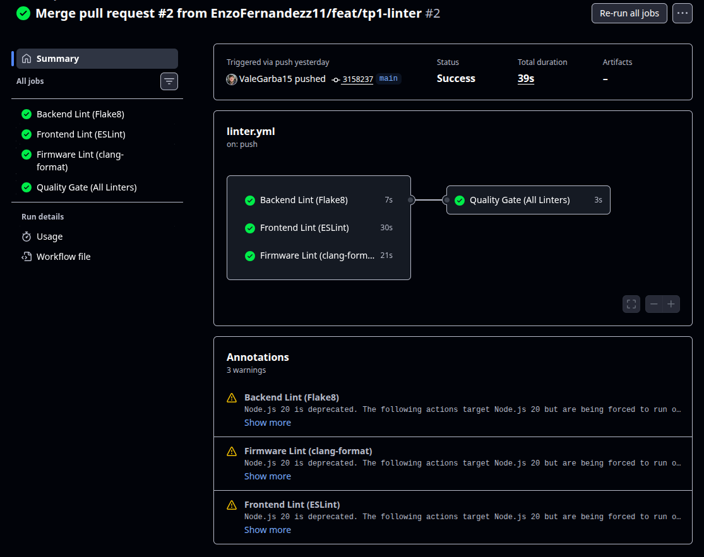
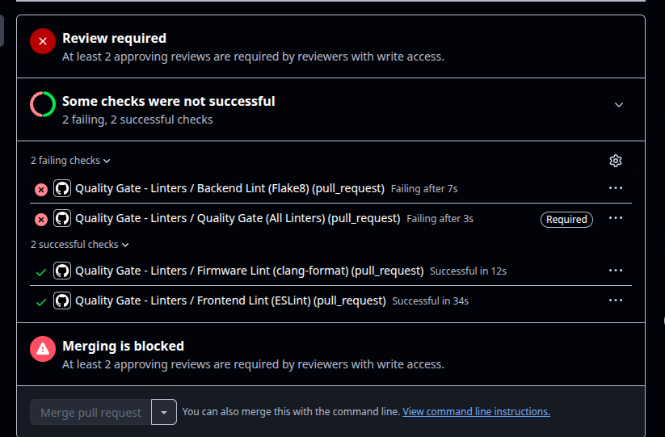
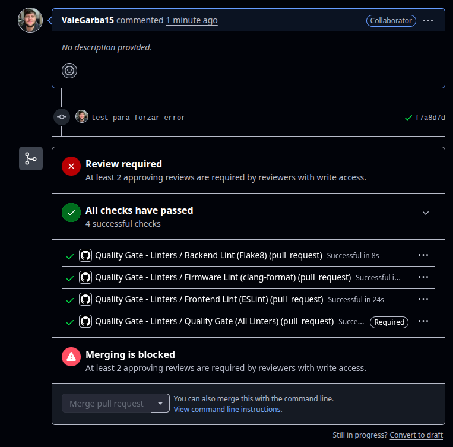
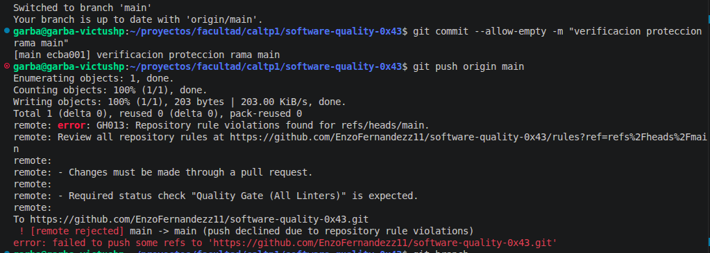

# TP1: Linter

# Gestión de la Calidad del Software

## Descripción del trabajo práctico

Este repositorio reutiliza el proyecto de Ingeniería de Software y se configura para aplicar controles automáticos de calidad mediante herramientas de linting. El objetivo del TP es validar el código antes de que se integre al repositorio principal, evitando que cambios con errores de estilo, inconsistencias o malas prácticas puedan pasar a `main` sin revisión.

La práctica se enmarca dentro del enfoque de aseguramiento de la calidad del software, con automatización de validaciones como parte del proceso de integración continua.

---

## ¿Cómo funciona?

La solución implementada se basa en un workflow de GitHub Actions que se ejecuta automáticamente cuando ocurre una actividad relevante sobre el repositorio.

### Trigger del workflow

El action se dispara cuando:

- se abre o actualiza una Pull Request hacia `main`, `development` o `develop`
- se hace un push a `main`

Esto queda definido en:

- [.github/workflows/linter.yml](.github/workflows/linter.yml)

### Arquitectura del workflow

El pipeline está dividido en jobs por tecnología:

1. Backend Flask
   - usa Flake8
   - se ejecuta sobre la aplicación Flask
   - configuración disponible en [backend/flask/final_project/.flake8](backend/flask/final_project/.flake8)

2. Frontend Next.js
   - usa ESLint
   - se ejecuta sobre el proyecto del dashboard
   - configuración en [frontend/dashboard/eslint.config.mjs](frontend/dashboard/eslint.config.mjs)

3. Firmware ESP32
   - usa `clang-format` para validar el formato del código C/C++
   - se valida dentro de [firmware/esp32](firmware/esp32)

Finalmente, existe un job llamado `quality-gate` que verifica que todos los linters anteriores hayan terminado correctamente. Si alguno falla, el check del workflow queda en estado fallido.

### Qué valida el linter

El workflow valida:

- errores de sintaxis y estilo en Python,
- errores y advertencias en JavaScript/TypeScript,
- formato y consistencia del código C/C++,
- La calidad mínima requerida para permitir la integración del cambio.

Si una de estas validaciones falla, el pipeline marca el estado como error y, con la protección de rama habilitada, bloquea el merge de la PR.

---

## ¿Qué área de calidad se trabaja?

Este trabajo se encuadra dentro de la norma **ISO/IEC 25010** (dentro de la familia ISO 25000 SQuaRe), enfocado en la característica de Mantenibilidad del producto de software:

- Analizabilidad: La estandarización del formato y las reglas de linting facilitan la lectura del código y la identificación temprana de defectos.
- Modificabilidad: Código limpio y libre de patrones inconsistentes reduce el riesgo de introducir efectos colaterales al implementar nuevos cambios.
- Testabilidad: Asegura que el código mantenga una estructura coherente y predecible antes de someterse a pruebas automatizadas o manuales.
- Reusabilidad: La aplicación estricta de normas de estilo promueve la creación de módulos desacoplados y legibles para otros miembros del equipo.

Los linters no reemplazan la revisión humana, pero sí permiten detectar problemas tempranos y evitar que errores sencillos lleguen a producción o a la rama principal.

---

## Conclusión

Este Trabajo Práctico busca demostrar que la automatización de la calidad es una práctica clave en la ingeniería de software. Mediante linters y un workflow de GitHub Actions, el repositorio aplica validaciones automáticas y convierte la calidad en un gate de integración. La combinación de herramientas de linting y protección de ramas asegura un proceso más seguro, consistente y mantenible.

---

## Evidencia

### Evidencia 1

### Evidencia 2

### Evidencia 3

### Evidencia 4

---

## Archivos relevantes del proyecto

- [.github/workflows/linter.yml](.github/workflows/linter.yml)
- [backend/flask/final_project/.flake8](backend/flask/final_project/.flake8)
- [frontend/dashboard/eslint.config.mjs](frontend/dashboard/eslint.config.mjs)
- [backend/flask/final_project/requirements.txt](backend/flask/final_project/requirements.txt)
- [frontend/dashboard/package.json](frontend/dashboard/package.json)

