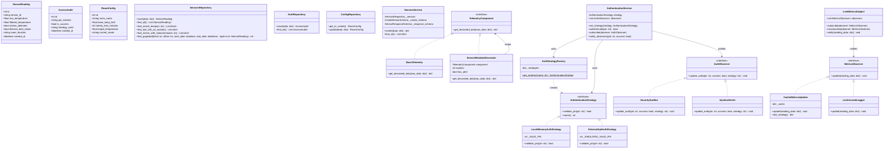

# Diagrama de Clases del Backend

```mermaid
classDiagram
    %% Entities / Models
    class SensorReading {
        +int id
        +string sensor_id
        +float raw_temperature
        +float filtered_temperature
        +bool motion_detected
        +bool thermal_alert_status
        +string room_location
        +datetime created_at
    }

    class AccessAudit {
        +int id
        +string pin_entered
        +bool is_success
        +string strategy_used
        +datetime created_at
    }

    class RoomConfig {
        +int id
        +string room_name
        +float base_temp_limit
        +int inertia_time_minutes
        +float target_temperature
        +string current_mode
    }

    %% Repositories
    class SensorsRepository {
        +save(data: dict) SensorReading
        +find_all() List~SensorReading~
        +find_recent_temps(n: int) List~float~
        +find_last_24h_no_motion() List~dict~
        +find_recent_with_motion(minutes: int) List~dict~
        +find_paginated(limit: int, offset: int, start_date: datetime, end_date: datetime) tuple~List~SensorReading~, int~
    }

    class AuthRepository {
        +save(data: dict) AccessAudit
        +find_all() List~AccessAudit~
    }

    class ConfigRepository {
        +get_or_create() RoomConfig
        +update(data: dict) RoomConfig
    }

    %% Services
    class SensorsService {
        -SensorsRepository _sensors
        -CreateSensorSchema _create_schema
        -SensorResponseSchema _response_schema
        +create(data: dict) dict
        +find_all() List~dict~
    }

    class AuthenticationService {
        -AuthenticationStrategy strategy
        -List~AuthObserver~ observers
        +set_strategy(strategy: AuthenticationStrategy)
        +authenticate(pin: str) bool
        +subscribe(observer: AuthObserver)
        +notify_observers(pin: str, success: bool)
    }

    %% Strategy Pattern (Authentication) + Factory
    class AuthenticationStrategy {
        <<interface>>
        +validate_pin(pin: str) bool
        +name() str
    }
    class LocalMemoryAuthStrategy {
        -str _VALID_PIN
        +validate_pin(pin: str) bool
    }
    class ExternalApiAuthStrategy {
        -str _SIMULATED_VALID_PIN
        +validate_pin(pin: str) bool
    }
    class AuthStrategyFactory {
        -dict _strategies
        +get_strategy(name: str)$ AuthenticationStrategy
    }
    AuthenticationStrategy <|.. LocalMemoryAuthStrategy
    AuthenticationStrategy <|.. ExternalApiAuthStrategy
    AuthStrategyFactory ..> AuthenticationStrategy : creates
    AuthenticationService --> AuthStrategyFactory : uses
    AuthenticationService --> AuthenticationStrategy : uses

    %% Decorator Pattern (Telemetry Enrichment)
    class TelemetryComponent {
        <<interface>>
        +get_decorated_data(raw_data: dict) dict
    }
    class BaseTelemetry {
        +get_decorated_data(raw_data: dict) dict
    }
    class SensorMetadataDecorator {
        -TelemetryComponent component
        -str location
        -bool has_alert
        +get_decorated_data(raw_data: dict) dict
    }
    TelemetryComponent <|.. BaseTelemetry
    TelemetryComponent <|.. SensorMetadataDecorator
    SensorMetadataDecorator --> TelemetryComponent : wraps

    %% Observer Pattern 1 (Live Metrics Subject)
    class MetricsObserver {
        <<interface>>
        +update(reading_data: dict) void
    }
    class CacheMetricsUpdater {
        -dict _cache
        +update(reading_data: dict) void
        +last_reading() dict
    }
    class LiveConsoleLogger {
        +update(reading_data: dict) void
    }
    class LiveMetricsSubject {
        -List~MetricsObserver~ observers
        +subscribe(observer: MetricsObserver)
        +unsubscribe(observer: MetricsObserver)
        +notify(reading_data: dict) void
    }
    LiveMetricsSubject --> MetricsObserver : notifies
    MetricsObserver <|.. CacheMetricsUpdater
    MetricsObserver <|.. LiveConsoleLogger

    %% Observer Pattern 2 (Security Auditing)
    class AuthObserver {
        <<interface>>
        +update_auth(pin: str, success: bool, strategy: str) void
    }
    class SecurityAuditor {
        +update_auth(pin: str, success: bool, strategy: str) void
    }
    class SystemAlerter {
        +update_auth(pin: str, success: bool, strategy: str) void
    }
    AuthenticationService --> AuthObserver : notifies
    AuthObserver <|.. SecurityAuditor
    AuthObserver <|.. SystemAlerter
```
