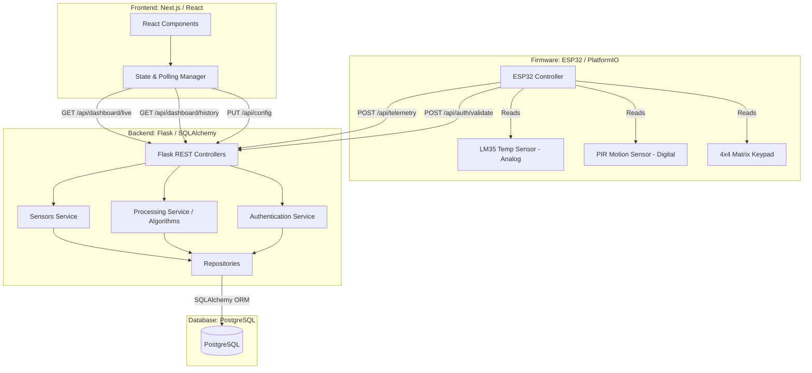

# Diagrama de Componentes

```mermaid
graph TD
    subgraph ESP32 [Firmware: ESP32 / PlatformIO]
        ESP[ESP32 Controller]
        LM35[LM35 Temp Sensor - Analog]
        PIR[PIR Motion Sensor - Digital]
        Keypad[4x4 Matrix Keypad]
        ESP -->|Reads| LM35
        ESP -->|Reads| PIR
        ESP -->|Reads| Keypad
    end

    subgraph Backend [Backend: Flask / SQLAlchemy]
        API[Flask REST Controllers]
        S_Sensors[Sensors Service]
        S_Process[Processing Service / Algorithms]
        S_Auth[Authentication Service]
        Repo[Repositories]
        
        API --> S_Sensors
        API --> S_Process
        API --> S_Auth
        S_Sensors --> Repo
        S_Process --> Repo
        S_Auth --> Repo
    end

    subgraph Database [Database: PostgreSQL]
        DB[(PostgreSQL)]
        Repo -->|SQLAlchemy ORM| DB
    end

    subgraph Frontend [Frontend: Next.js / React]
        UI[React Components]
        Store[State & Polling Manager]
        UI --> Store
    end

    %% Communications
    ESP -->|POST /api/telemetry| API
    ESP -->|POST /api/auth/validate| API
    Store -->|GET /api/dashboard/live| API
    Store -->|GET /api/dashboard/history| API
    Store -->|PUT /api/config| API
```
