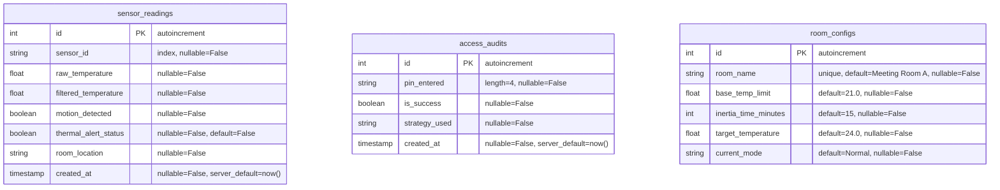

# Diagrama Entidad-Relación (Base de Datos)

```mermaid
erDiagram
    sensor_readings {
        int id PK "autoincrement"
        string sensor_id "index, nullable=False"
        float raw_temperature "nullable=False"
        float filtered_temperature "nullable=False"
        boolean motion_detected "nullable=False"
        boolean thermal_alert_status "nullable=False, default=False"
        string room_location "nullable=False"
        timestamp created_at "nullable=False, server_default=now()"
    }
    access_audits {
        int id PK "autoincrement"
        string pin_entered "length=4, nullable=False"
        boolean is_success "nullable=False"
        string strategy_used "nullable=False"
        timestamp created_at "nullable=False, server_default=now()"
    }
    room_configs {
        int id PK "autoincrement"
        string room_name "unique, default=Meeting Room A, nullable=False"
        float base_temp_limit "default=21.0, nullable=False"
        int inertia_time_minutes "default=15, nullable=False"
        float target_temperature "default=24.0, nullable=False"
        string current_mode "default=Normal, nullable=False"
    }
```
