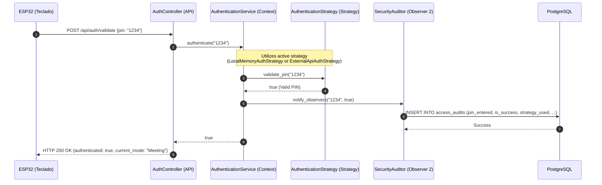

# Diagrama de Secuencia: Autenticación por Teclado (UC-02)

```mermaid
sequenceDiagram
    autonumber
    participant ESP as ESP32 (Teclado)
    participant Ctrl as AuthController (API)
    participant Serv as AuthenticationService (Context)
    participant Strat as AuthenticationStrategy (Strategy)
    participant Obs as SecurityAuditor (Observer 2)
    participant DB as PostgreSQL

    ESP->>Ctrl: POST /api/auth/validate {pin: "1234"}
    Ctrl->>Serv: authenticate("1234")
    Note over Serv, Strat: Utilizes active strategy<br/>(LocalMemoryAuthStrategy or ExternalApiAuthStrategy)
    Serv->>Strat: validate_pin("1234")
    Strat-->>Serv: true (Valid PIN)
    Serv->>Obs: notify_observers("1234", true)
    Obs->>DB: INSERT INTO access_audits (pin_entered, is_success, strategy_used, ...)
    DB-->>Obs: Success
    Serv-->>Ctrl: true
    Ctrl-->>ESP: HTTP 200 OK {authenticated: true, current_mode: "Meeting"}
```
