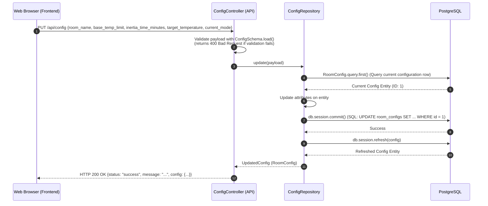

# Diagrama de Secuencia: Configuración de Umbrales (UC-04)

```mermaid
sequenceDiagram
    autonumber
    participant Browser as Web Browser (Frontend)
    participant Ctrl as ConfigController (API)
    participant Repo as ConfigRepository
    participant DB as PostgreSQL

    Browser->>Ctrl: PUT /api/config {room_name, base_temp_limit, inertia_time_minutes, target_temperature, current_mode}
    Ctrl->>Ctrl: Validate payload with ConfigSchema.load()<br/>(returns 400 Bad Request if validation fails)
    Ctrl->>Repo: update(payload)
    Repo->>DB: RoomConfig.query.first() (Query current configuration row)
    DB-->>Repo: Current Config Entity (ID: 1)
    Repo->>Repo: Update attributes on entity
    Repo->>DB: db.session.commit() (SQL: UPDATE room_configs SET ... WHERE id = 1)
    DB-->>Repo: Success
    Repo->>DB: db.session.refresh(config)
    DB-->>Repo: Refreshed Config Entity
    Repo-->>Ctrl: UpdatedConfig (RoomConfig)
    Ctrl-->>Browser: HTTP 200 OK {status: "success", message: "...", config: {...}}
```

