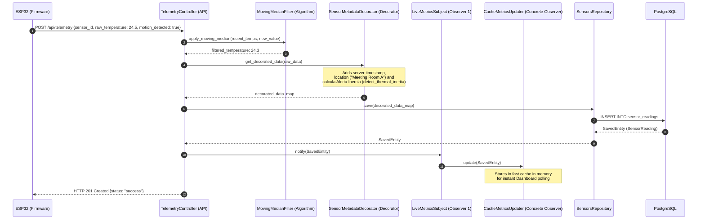

# Diagrama de Secuencia: Ingesta de Telemetría (UC-01)

```mermaid
sequenceDiagram
    autonumber
    participant ESP as ESP32 (Firmware)
    participant Ctrl as TelemetryController (API)
    participant Filter as MovingMedianFilter (Algorithm)
    participant Dec as SensorMetadataDecorator (Decorator)
    participant Subject as LiveMetricsSubject (Observer 1)
    participant Cache as CacheMetricsUpdater (Concrete Observer)
    participant Repo as SensorsRepository
    participant DB as PostgreSQL

    ESP->>Ctrl: POST /api/telemetry {sensor_id, raw_temperature: 24.5, motion_detected: true}
    Ctrl->>Filter: apply_moving_median(recent_temps, new_value)
    Filter-->>Ctrl: filtered_temperature: 24.3
    Ctrl->>Dec: get_decorated_data(raw_data)
    Note over Dec: Adds server timestamp,<br/>location ("Meeting Room A") and<br/>calcula Alerta Inercia (detect_thermal_inertia)
    Dec-->>Ctrl: decorated_data_map
    Ctrl->>Repo: save(decorated_data_map)
    Repo->>DB: INSERT INTO sensor_readings
    DB-->>Repo: SavedEntity (SensorReading)
    Repo-->>Ctrl: SavedEntity
    Ctrl->>Subject: notify(SavedEntity)
    Subject->>Cache: update(SavedEntity)
    Note over Cache: Stores in fast cache in memory<br/>for instant Dashboard polling
    Ctrl-->>ESP: HTTP 201 Created {status: "success"}
```
